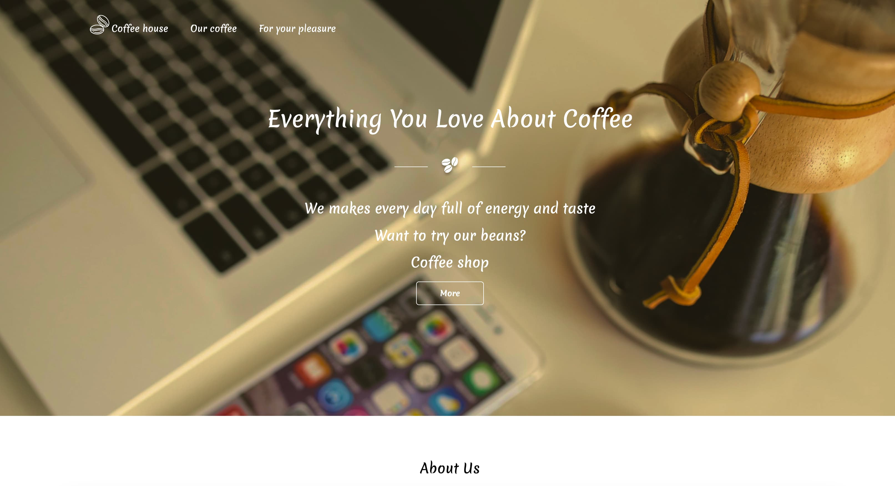

# Coffee House Website

This project is an adaptive website for a coffee shop. The site is made with modern design, which provides ease of use and aesthetic presentation of information. The main functionality includes displaying menus, information about the coffee shop, product cards, filters and animations.

## Technologies

The following technologies are used in the project:

HTML5

	- Semantic markup to improve structure and SEO.
	- Optimization for easy code perception.

CSS3

	- Use of CSS variables for easy style management.
	- Flexbox and Grid Layout for adaptive layout.
	- Custom animations (keyframes) to improve user experience.
	- Shadow and gradient system for visual design enhancement.

JavaScript (REACT.JS)

	- Dynamic management of filters and cards.
	- Implementation of interactive elements such as buttons and forms.

Adaptive design

	- Media queries to ensure correct display on devices with different resolutions (desktops, tablets, cell phones).

Optimization and performance

	- Minimalistic design to reduce loading time.
	- Use of images with optimized size.